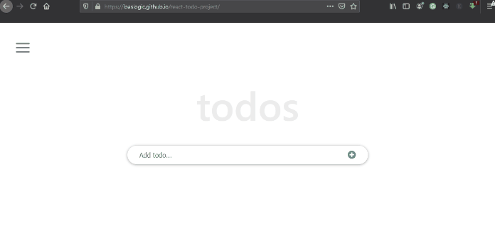

# TODO LIST APP
> This project, is a simple to do list app that will help manage task by making such a list, you ensure that all of your chores are written down in one spot, ensuring that you don't overlook anything vital. And by prioritizing tasks, you determine the sequence in which you'll complete them, so you know what needs your immediate attention and what can wait.

## Built With
- React Js
- React & Redux linters
## Live Demo
> ###### [LIVE DEMO LINK](https://aime-todo-app.netlify.app)

## Getting Started
- clone the repository by running\
    `git clone https://github.com/aimemalaika/math-magicians.git`
- navigate to the folder\
    `cd math-magicians`
- Install packages\
    `npm install`
- Run the app\
    `npm start`
- Eject the app\
    `npm run eject`
- Create build app\
    `npm run build`
- Test Linters app\
    `npm run check-linters`

## Authors 

👤 **Aime Malaika**
- GitHub: [@aimemalaika](https://github.com/aimemalaika)
- Twitter: [@aimemalaika](https://twitter.com/Aime_Malaika)
- LinkedIn: [aimemalaika](https://linkedin.com/in/aimemalaika)

## :handshake: Contributing
Contributions, issues, and feature requests are welcome!
## Show your support
Give a :star:️ if you like this project!
## :memo: License
This project is [MIT](./MIT.md) licensed.